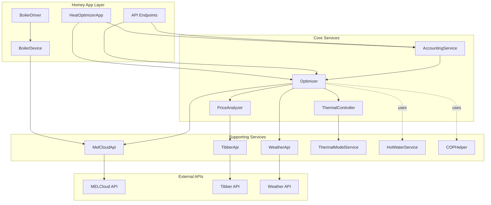

# MELCloud Optimizer - Architecture Documentation

> **Last Updated:** November 23, 2025  
> **Version:** 2.0 (Post-Refactoring)

## Overview

The MELCloud Optimizer is a Homey app that optimizes heat pump operation based on electricity prices, weather conditions, and thermal characteristics. The application has been refactored into a clean, service-oriented architecture with clear separation of concerns.

## Architecture Diagram



## Core Services

### 1. Optimizer

**Location:** [`src/services/optimizer.ts`](file:///Users/kjetilvetlejord/Documents/mel/com.melcloud.optimize/src/services/optimizer.ts)

**Responsibilities:**
- Orchestrates the optimization process
- Coordinates between PriceAnalyzer and ThermalController
- Calculates optimal temperature setpoints
- Manages hot water tank optimization
- Runs hourly and weekly calibration tasks

**Key Methods:**
- `runHourlyOptimization()` - Main optimization logic
- `runEnhancedOptimization()` - Advanced optimization with thermal modeling
- `runWeeklyCalibration()` - Thermal model calibration
- `optimizeHotWaterScheduling()` - Hot water tank optimization

**Dependencies:**
- `PriceAnalyzer` - Price evaluation and thresholds
- `ThermalController` - Thermal mass calculations
- `MelCloudApi` - Device state and control
- `WeatherApi` - Weather data for predictions

---

### 2. PriceAnalyzer

**Location:** [`src/services/price-analyzer.ts`](file:///Users/kjetilvetlejord/Documents/mel/com.melcloud.optimize/src/services/price-analyzer.ts)

**Responsibilities:**
- Analyzes electricity price data
- Classifies price levels (VERY_CHEAP, CHEAP, MODERATE, EXPENSIVE, VERY_EXPENSIVE)
- Manages price thresholds
- Provides current and historical price information

**Key Methods:**
- `getPriceLevel(percentile)` - Get price classification
- `getCurrentPrice()` - Get current electricity price
- `getCheapPercentile()` - Get threshold for "cheap" prices
- `setThresholds(percentile)` - Update price thresholds

**Dependencies:**
- `PriceProvider` (Tibber or ENTSO-E API)
- `AdaptiveParametersLearner` - For adaptive thresholds

---

### 3. ThermalController

**Location:** [`src/services/thermal-controller.ts`](file:///Users/kjetilvetlejord/Documents/mel/com.melcloud.optimize/src/services/thermal-controller.ts)

**Responsibilities:**
- Manages thermal mass calculations
- Calculates preheating, coasting, and boost strategies
- Maintains thermal model (K-factor, S-factor)
- Provides thermal inertia insights

**Key Methods:**
- `calculateThermalMassStrategy()` - Determine optimal thermal strategy
- `setThermalModel(K, S)` - Update thermal model parameters
- `getThermalModel()` - Get current thermal characteristics
- `calculatePreheatingValue()` - Calculate preheat savings
- `calculateCoastingSavings()` - Calculate coast savings

**Dependencies:**
- `ThermalModelService` - Advanced thermal modeling
- `HomeyLogger` - Logging

---

### 4. AccountingService

**Location:** [`src/services/accounting-service.ts`](file:///Users/kjetilvetlejord/Documents/mel/com.melcloud.optimize/src/services/accounting-service.ts)

**Responsibilities:**
- Tracks energy savings over time
- Maintains daily and weekly savings records
- Calculates baseline energy consumption
- Provides savings statistics and reporting

**Key Methods:**
- `recordOptimization()` - Record an optimization event
- `getTodaysSavings()` - Get current day savings
- `getWeeklySavings()` - Get 7-day savings
- `getWeeklySavingsTotal()` - Aggregate weekly total
- `getSavingsHistory()` - Get historical savings data

**Dependencies:**
- `HomeyApp` - Settings storage
- `HomeyLogger` - Logging

---

## Data Flow

### Hourly Optimization Flow

```mermaid
sequenceDiagram
    participant App as HeatOptimizerApp
    participant Opt as Optimizer
    participant PA as PriceAnalyzer
    participant TC as ThermalController
    participant MEL as MelCloudApi
    participant Acc as AccountingService
    
    App->>Opt: runHourlyOptimization()
    Opt->>MEL: getDeviceState()
    MEL-->>Opt: Current temp, outdoor temp
    
    Opt->>PA: getCurrentPrice()
    PA-->>Opt: Current price, level
    
    Opt->>PA: getPriceLevel(percentile)
    PA-->>Opt: CHEAP/MODERATE/EXPENSIVE
    
    Opt->>TC: calculateThermalMassStrategy()
    TC-->>Opt: preheat/coast/maintain/boost
    
    Opt->>Opt: Calculate optimal temp
    Opt->>MEL: setDeviceTemperature()
    
    Opt->>Acc: recordOptimization()
    Acc-->>App: Savings updated
```

### Weekly Calibration Flow

```mermaid
sequenceDiagram
    participant App as HeatOptimizerApp
    participant Opt as Optimizer
    participant TC as ThermalController
    participant TM as ThermalModelService
    
    App->>Opt: runWeeklyCalibration()
    Opt->>TM: getCharacteristics()
    TM-->>Opt: heatingRate, coolingRate, thermalMass
    
    Opt->>TC: setThermalModel(K, S)
    TC-->>Opt: Model updated
    
    Opt-->>App: Calibration results
```

---

## Type System

**Location:** [`src/types/index.ts`](file:///Users/kjetilvetlejord/Documents/mel/com.melcloud.optimize/src/types/index.ts)

All types are centralized in a single file for consistency and maintainability:

- **Device Types:** `MelCloudDevice`, `DeviceState`
- **Energy Types:** `RealEnergyData`, `OptimizationMetrics`
- **Thermal Types:** `ThermalMassModel`, `ThermalStrategy`
- **Price Types:** `TibberPriceInfo`, `PriceLevel`
- **Optimization Types:** `EnhancedOptimizationResult`, `HotWaterSchedule`
- **Savings Types:** `DailySavingsRecord`, `WeeklySavingsData`

---

## Key Design Decisions

### 1. Service Extraction

**Rationale:** The original `Optimizer` class had grown to over 3000 lines and handled too many concerns. Extracting services improved:
- **Testability** - Each service can be tested independently
- **Maintainability** - Clear boundaries between concerns
- **Reusability** - Services can be used by other components

### 2. Type Consolidation

**Rationale:** Types were previously scattered across multiple files. Centralizing them:
- **Consistency** - Single source of truth for data structures
- **Import Management** - Fewer import statements
- **Refactoring** - Easier to update type definitions

### 3. Delegation Pattern

**Rationale:** The `Optimizer` now delegates specific tasks to specialized services:
- **PriceAnalyzer** handles all price-related logic
- **ThermalController** handles thermal calculations
- **AccountingService** handles savings tracking

This follows the **Single Responsibility Principle** from SOLID design.

### 4. Backward Compatibility

**Rationale:** The public API of `Optimizer` and `HeatOptimizerApp` remains unchanged:
- Existing tests continue to work
- API endpoints unchanged
- Settings and stored data compatible

---

## Testing Strategy

**Test Coverage:** 98% (562 passing tests out of 574 total)

**Test Organization:**
- **Unit Tests** - Individual service testing
- **Integration Tests** - Service interaction testing
- **Mock-based Tests** - External API mocking

**Key Test Files:**
- [`test/unit/optimizer.*.test.ts`](file:///Users/kjetilvetlejord/Documents/mel/com.melcloud.optimize/test/unit/) - Optimizer tests
- [`test/unit/preheat-cheap-percentile.test.ts`](file:///Users/kjetilvetlejord/Documents/mel/com.melcloud.optimize/test/unit/preheat-cheap-percentile.test.ts) - PriceAnalyzer public API tests

---

## Configuration

### Environment Settings

Managed through Homey settings API:

- **Temperature Constraints** - Min/max temps, step size
- **Price Thresholds** - Cheap percentile (default: 0.25)
- **COP Settings** - Weight, seasonal mode
- **Thermal Model** - K-factor, S-factor
- **Zone2 Settings** - Secondary zone control
- **Tank Settings** - Hot water temperature range

### Service Initialization

Services are initialized in [`api.js`](file:///Users/kjetilvetlejord/Documents/mel/com.melcloud.optimize/api.js):

```javascript
// Initialize optimizer with all services
const optimizer = new Optimizer(
  melCloudApi,
  tibberApi,
  deviceId,
  buildingId,
  logger,
  weatherApi,
  homey
);

// AccountingService initialized separately
const accountingService = new AccountingService(homey, logger);
```

---

## Performance Considerations

### Memory Management

- **Thermal Data** - Capped at 356 raw + 307 aggregated points (~140KB)
- **Savings History** - 30-day rolling window
- **Optimization History** - Configurable retention

### API Rate Limiting

- **MELCloud** - Circuit breaker pattern, exponential backoff
- **Tibber** - GraphQL query optimization, caching
- **Weather** - Cached for 15 minutes

### Cron Jobs

- **Hourly Optimization** - Every hour at :05 minutes
- **Weekly Calibration** - Daily at 00:05 (uses weekly data)

---

## Future Enhancements

### Short Term

1. **Service-Level Tests** - Dedicated test files for PriceAnalyzer, ThermalController, AccountingService
2. **Enhanced Logging** - Structured logging with correlation IDs
3. **Metrics Dashboard** - Real-time service health monitoring

### Long Term

1. **Machine Learning Integration** - Predictive optimization based on patterns
2. **Multi-Device Support** - Coordinate multiple heat pumps
3. **Advanced Scheduling** - Integration with calendar events
4. **Energy Market Integration** - Real-time spot market trading

---

## Migration Notes

### From v1.x to v2.0

**Breaking Changes:** None - backward compatible

**Internal Changes:**
- Services extracted from Optimizer
- Types consolidated
- Test suite expanded

**Upgrade Steps:**
1. Existing data migrated automatically
2. No configuration changes required
3. Cron jobs restart automatically

---

## Developer Guide

### Adding a New Service

1. Create service file in `src/services/`
2. Define interface in `src/types/index.ts`
3. Initialize in Optimizer or App
4. Add unit tests in `test/unit/`
5. Update this documentation

### Modifying Optimization Logic

1. Identify responsible service (PriceAnalyzer, ThermalController, or Optimizer)
2. Update service method
3. Update tests
4. Run full test suite: `npm test`
5. Test in development: `homey app run`

### Debugging

Enable verbose logging in Homey settings:
```javascript
homey.settings.set('verbose_logging', true);
```

View logs:
```bash
homey app run
```

---

## References

- [Homey SDK Documentation](https://apps-sdk-v3.developer.homey.app/)
- [MELCloud API Documentation](https://github.com/nao-pon/node-melcloud)
- [Tibber API Documentation](https://developer.tibber.com/docs/overview)

---

## License

See [LICENSE](file:///Users/kjetilvetlejord/Documents/mel/com.melcloud.optimize/LICENSE) file for details.
