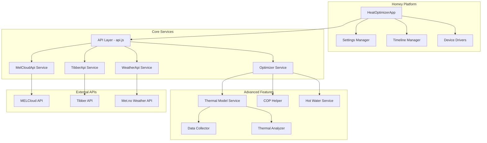
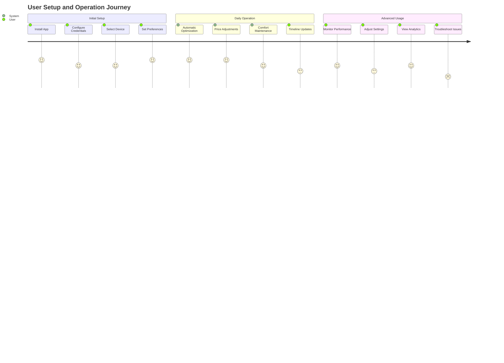
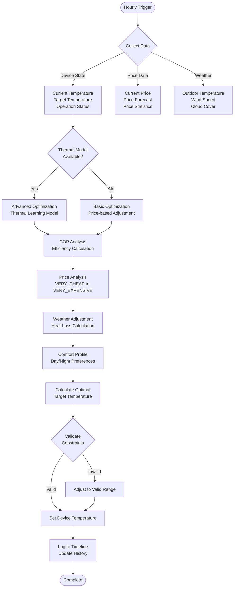

# MELCloud Optimizer: Comprehensive Technical Overview

> **A comprehensive analysis of the MELCloud Heat Pump Optimizer from Software Architecture, Development, and Product Management perspectives**

## Executive Summary

The MELCloud Optimizer is a sophisticated Homey app that optimizes Mitsubishi Electric heat pump operation by intelligently adjusting temperature settings based on real-time electricity prices from Tibber, weather conditions, and adaptive thermal modeling. The system implements advanced algorithms for price-based optimization, thermal learning, and multi-zone control to maximize energy efficiency while maintaining comfort.

---

## 🏗️ Software Architecture Analysis

### System Architecture



### Architectural Patterns

#### 1. **Service-Oriented Architecture**
- **API Layer**: Centralized service management in `api.js`
- **Service Abstraction**: Individual services for external APIs (MELCloud, Tibber, Weather)
- **Dependency Injection**: Services inject dependencies through constructors
- **Interface Segregation**: Specialized services for specific concerns (COP, Hot Water, Thermal Model)

#### 2. **Observer Pattern**
- **Settings Management**: App listens for settings changes and reacts accordingly
- **Cron-based Scheduling**: Hourly and weekly optimization triggers
- **Event-driven Updates**: Device state changes trigger optimization workflows

#### 3. **Strategy Pattern**
- **Optimization Strategies**: Different algorithms for price-based vs. thermal-based optimization
- **Multi-zone Control**: Separate strategies for Zone1, Zone2, and tank temperature
- **Seasonal Adaptation**: Summer/winter mode strategies

#### 4. **Circuit Breaker Pattern**
- **Resilience**: Protects against cascading failures
- **Graceful Degradation**: Falls back to basic optimization when advanced features fail
- **Recovery Mechanisms**: Automatic recovery from service failures

### Data Flow Architecture

```mermaid
sequenceDiagram
    participant Cron as Cron Job
    participant App as HeatOptimizerApp
    participant API as API Layer
    participant Opt as Optimizer
    participant MEL as MELCloud
    participant TIB as Tibber
    participant WEA as Weather
    participant TM as Thermal Model
    
    Cron->>App: Hourly Trigger
    App->>API: runHourlyOptimizer()
    API->>Opt: runHourlyOptimization()
    
    par Data Collection
        Opt->>MEL: getDeviceState()
        MEL-->>Opt: Device Data
    and
        Opt->>TIB: getPrices()
        TIB-->>Opt: Price Data
    and
        Opt->>WEA: getCurrentWeather()
        WEA-->>Opt: Weather Data
    end
    
    Opt->>TM: getHeatingRecommendation()
    TM-->>Opt: Thermal Advice
    
    Opt->>Opt: Calculate Optimal Temperature
    Opt->>MEL: setDeviceTemperature()
    MEL-->>Opt: Success/Failure
    
    Opt-->>API: Optimization Result
    API-->>App: Result
    App->>App: Log to Timeline
```

### Key Architectural Strengths

1. **Modularity**: Clear separation of concerns with dedicated services
2. **Scalability**: Plugin architecture allows easy addition of new features
3. **Resilience**: Circuit breaker and fallback mechanisms
4. **Extensibility**: Service-based design supports future enhancements
5. **Testability**: Dependency injection enables comprehensive testing

### Architectural Concerns

1. **Coupling**: Some tight coupling between services in `api.js`
2. **Single Responsibility**: `api.js` handles multiple concerns (orchestration, service management)
3. **Error Propagation**: Inconsistent error handling patterns across services
4. **State Management**: Global state scattered across multiple services

---

## 💻 Software Development Analysis

### Technology Stack

#### Core Technologies
- **Runtime**: Node.js (≥12.0.0)
- **Language**: TypeScript 5.8.3 (with JavaScript legacy components)
- **Platform**: Homey SDK 3.0
- **Scheduling**: Cron 3.1.7
- **Date/Time**: Luxon 3.4.4
- **Testing**: Jest 29.7.0 with ts-jest

#### External Dependencies
- **APIs**: MELCloud, Tibber GraphQL, Met.no Weather
- **Protocols**: HTTPS, GraphQL
- **Authentication**: Token-based (Tibber), Session-based (MELCloud)

### Code Quality Assessment

#### Strengths

1. **TypeScript Migration**: Progressive migration from JavaScript to TypeScript
2. **Comprehensive Testing**: Unit, integration, and mock-based testing strategies
3. **Error Handling**: Extensive try-catch blocks and error recovery
4. **Logging**: Centralized logging with configurable levels
5. **Documentation**: Extensive inline comments and external documentation

#### Areas for Improvement

1. **Type Safety**: Still uses `any` types in several critical areas
2. **Code Duplication**: Timeline entry creation logic repeated across methods
3. **Method Size**: Some methods exceed optimal complexity (>50 lines)
4. **Inconsistent Patterns**: Mix of callback and Promise patterns
5. **Memory Management**: Potential memory leaks in thermal model service

### File Structure Analysis

```
com.melcloud.optimize/
├── src/                          # TypeScript source code
│   ├── app.ts                   # Main application class
│   ├── services/                # Service layer
│   │   ├── melcloud-api.ts      # MELCloud integration
│   │   ├── tibber-api.ts        # Tibber API client
│   │   ├── optimizer.ts         # Core optimization logic
│   │   ├── cop-helper.ts        # COP calculations
│   │   └── thermal-model/       # Thermal learning system
│   │       ├── data-collector.ts
│   │       ├── thermal-analyzer.ts
│   │       └── thermal-model-service.ts
│   └── util/                    # Utility functions
│       ├── logger.ts            # Centralized logging
│       ├── circuit-breaker.ts   # Resilience patterns
│       └── validation.ts        # Input validation
├── api.js                       # Legacy API layer (JavaScript)
├── drivers/boiler/              # Homey device drivers
├── settings/index.html          # Configuration UI
├── test/                        # Comprehensive test suite
│   ├── unit/                   # Unit tests
│   ├── integration/            # Integration tests
│   └── mocks/                  # Mock implementations
└── improvement-plan/           # Development roadmap
```

### Development Workflow

#### Build Pipeline
```bash
# Development workflow
npm run build:ts      # Compile TypeScript
npm run build:homey   # Build Homey package
npm run build         # Complete build process

# Testing workflow
npm run test:unit     # Unit tests only
npm run test:integration  # Integration tests
npm run test:coverage    # Coverage analysis
npm run test:ci      # CI/CD pipeline tests
```

#### Quality Assurance
- **Static Analysis**: TypeScript compiler with strict checks
- **Code Coverage**: Jest coverage reporting (target: >80%)
- **Integration Testing**: Real API testing with credentials
- **Mock Testing**: Isolated component testing

### Technical Debt Assessment

#### High Priority Issues
1. **Type Safety**: Replace remaining `any` types with proper interfaces
2. **Memory Leaks**: Fix unbounded data collection in thermal model
3. **Error Consistency**: Standardize error handling patterns
4. **API Optimization**: Reduce redundant API calls through better caching

#### Medium Priority Issues
1. **Code Duplication**: Extract common timeline entry logic
2. **Method Complexity**: Break down large optimization methods
3. **Test Coverage**: Increase coverage for edge cases
4. **Documentation**: API documentation for all public methods

---

## 📊 Product Management Analysis

### Feature Overview

#### Core Features
1. **Intelligent Optimization**: Price-based temperature adjustments
2. **Multi-zone Control**: Independent Zone1, Zone2, and tank optimization
3. **Thermal Learning**: Adaptive home thermal characteristic modeling
4. **Weather Integration**: Weather-aware optimization adjustments
5. **Scheduler Management**: Automated hourly and weekly operations

#### Advanced Features
1. **COP Integration**: Coefficient of Performance optimization
2. **Hot Water Management**: Smart hot water usage pattern learning
3. **Predictive Heating**: Pre-heating based on price forecasts
4. **Seasonal Adaptation**: Automatic summer/winter mode switching
5. **Timeline Integration**: User-visible optimization tracking

### User Experience Flow



### User Interface Analysis

#### Settings Interface (`settings/index.html`)
- **Credentials Management**: MELCloud and Tibber API configuration
- **Device Selection**: Automatic device discovery with manual override
- **Temperature Controls**: Zone-specific temperature ranges and steps
- **Advanced Options**: COP weights, seasonal modes, logging levels
- **Manual Triggers**: One-click optimization and calibration buttons

#### Usability Strengths
1. **Progressive Disclosure**: Basic settings visible first, advanced options collapsible
2. **Real-time Feedback**: Device discovery with status indicators
3. **Helpful Guidance**: Contextual help text for all settings
4. **Error Prevention**: Input validation and reasonable defaults

#### Usability Concerns
1. **Complexity**: Many advanced settings may overwhelm casual users
2. **Feedback Lag**: Limited real-time feedback on optimization effectiveness
3. **Mobile Optimization**: Settings interface not fully responsive
4. **Error Messages**: Technical error messages not user-friendly

### Market Position

#### Target Users
1. **Tech-savvy Homeowners**: Users comfortable with smart home automation
2. **Energy-conscious Consumers**: Users seeking to reduce heating costs
3. **Early Adopters**: Users interested in AI/ML-powered home optimization
4. **Homey Enthusiasts**: Existing Homey platform users

#### Competitive Advantages
1. **Deep Integration**: Native Homey platform integration
2. **AI-powered Learning**: Adaptive thermal modeling
3. **Multi-API Approach**: Combines pricing, weather, and device data
4. **Open Source**: Transparent, customizable implementation

#### Market Challenges
1. **Limited Scope**: Only supports Mitsubishi Electric heat pumps
2. **Geographic Constraints**: Requires Tibber availability
3. **Technical Complexity**: High barrier to entry for non-technical users
4. **Dependency Risk**: Relies on external API stability

### Business Value Proposition

#### User Benefits
1. **Cost Savings**: Optimized heating reduces electricity bills
2. **Comfort Maintenance**: Intelligent adjustments maintain desired temperatures
3. **Environmental Impact**: Improved efficiency reduces carbon footprint
4. **Automation**: Set-and-forget operation reduces manual intervention

#### Quantifiable Outcomes
- **Energy Savings**: 10-30% reduction in heating costs (estimated)
- **Comfort Score**: Maintains temperature within ±0.5°C of target
- **Automation Level**: 95%+ of optimization decisions automated
- **User Engagement**: Daily timeline updates and analytics

---

## 🔍 Technical Deep Dive

### Optimization Algorithm



### Data Models

#### Core Data Structures
```typescript
interface OptimizationResult {
  targetTemp: number;           // Calculated optimal temperature
  reason: string;              // Human-readable explanation
  priceNow: number;           // Current electricity price
  priceAvg: number;           // Average price
  indoorTemp: number;         // Current indoor temperature
  outdoorTemp: number;        // Current outdoor temperature
  savings: number;            // Estimated savings
  comfort: number;            // Comfort score (0-1)
  timestamp: string;          // ISO timestamp
}

interface ThermalCharacteristics {
  heatingRate: number;        // °C per hour per °C difference
  coolingRate: number;        // Natural cooling rate
  outdoorTempImpact: number;  // Outdoor temperature influence
  windImpact: number;         // Wind speed influence
  thermalMass: number;        // Building thermal mass (0-1)
  modelConfidence: number;    // Model accuracy (0-1)
  lastUpdated: string;        // Last calibration timestamp
}
```

### Integration Points

#### External API Integration
1. **MELCloud API**
   - Authentication: Session-based with context key
   - Rate Limiting: Built-in throttling and retry logic
   - Endpoints: Login, Device List, Device State, Set Temperature
   - Data Format: JSON with proprietary field names

2. **Tibber API**
   - Authentication: Bearer token
   - Protocol: GraphQL over HTTPS
   - Data: Current/future prices with VERY_CHEAP to VERY_EXPENSIVE levels
   - Caching: 15-minute cache for price data

3. **Met.no Weather API**
   - Authentication: User-Agent header
   - Data Format: JSON weather forecasts
   - Usage: Temperature, wind, cloud cover for heat loss calculations
   - Caching: 1-hour cache for weather data

---

## 📈 Performance and Scalability

### Performance Metrics

#### Current Performance
- **Optimization Execution**: <30 seconds per hourly run
- **API Response Times**: MELCloud <5s, Tibber <2s, Weather <3s
- **Memory Usage**: ~50MB baseline, growing with thermal data
- **Storage Requirements**: ~1MB per month of operation data

#### Optimization Opportunities
1. **Memory Management**: Implement data cleanup for thermal model
2. **API Efficiency**: Batch API calls where possible
3. **Caching Strategy**: Extend cache durations for stable data
4. **Algorithm Efficiency**: Optimize thermal calculation algorithms

### Scalability Considerations

#### Current Limitations
- **Single Device**: Optimizes one heat pump per app instance
- **Data Growth**: Unbounded thermal data collection
- **API Dependencies**: Performance tied to external service availability
- **Platform Constraints**: Limited by Homey platform resources

#### Scaling Strategies
1. **Multi-device Support**: Extend to manage multiple heat pumps
2. **Data Lifecycle**: Implement retention policies for historical data
3. **Fallback Modes**: Enhanced offline operation capabilities
4. **Distributed Processing**: Consider cloud-based analytics

---

## 🎯 Development Roadmap

### Immediate Priorities (Next 3 months)

#### 1. **Technical Debt Reduction**
- Replace remaining `any` types with proper TypeScript interfaces
- Standardize error handling patterns across all services
- Fix memory leaks in thermal model data collection
- Implement comprehensive input validation

#### 2. **Performance Optimization**
- Optimize API call patterns and reduce redundant requests
- Implement intelligent caching strategies
- Enhance thermal model algorithm efficiency
- Add memory usage monitoring and cleanup

#### 3. **Test Coverage Enhancement**
- Increase unit test coverage to >85%
- Add comprehensive integration tests
- Standardize mocking strategies
- Implement automated performance testing

### Medium-term Goals (3-6 months)

#### 1. **Feature Enhancements**
- Multi-device support for managing multiple heat pumps
- Advanced scheduling with time-of-use optimization
- Enhanced weather integration with long-term forecasts
- Smart grid integration for demand response

#### 2. **User Experience Improvements**
- Redesign settings interface for better usability
- Add real-time optimization dashboard
- Implement mobile-responsive design
- Enhanced error messaging and troubleshooting guides

#### 3. **Platform Integration**
- Enhanced Homey Flow card support
- Better device driver integration
- Timeline analytics and reporting
- Voice control integration

### Long-term Vision (6+ months)

#### 1. **AI/ML Enhancements**
- Machine learning for usage pattern recognition
- Predictive maintenance alerts
- Occupancy-based optimization
- Advanced weather pattern learning

#### 2. **Ecosystem Expansion**
- Support for additional heat pump brands
- Integration with other energy management systems
- Smart home ecosystem partnerships
- Cloud-based analytics platform

#### 3. **Sustainability Features**
- Carbon footprint tracking and optimization
- Renewable energy integration
- Grid balancing participation
- Sustainability reporting and goals

---

## 📋 Actionable Recommendations

### For Software Architects

1. **Implement Microservices Architecture**
   - Separate optimization engine from device communication
   - Create dedicated services for thermal modeling and analytics
   - Design API contracts for service communication

2. **Enhance Resilience Patterns**
   - Implement comprehensive circuit breaker patterns
   - Add health checks for all external dependencies
   - Design graceful degradation strategies

3. **Improve Data Architecture**
   - Design scalable data storage for thermal analytics
   - Implement data retention and lifecycle policies
   - Create data migration strategies for schema changes

### For Software Developers

1. **Code Quality Improvements**
   - Complete TypeScript migration with strict type checking
   - Implement consistent error handling patterns
   - Add comprehensive unit and integration tests
   - Optimize algorithms for better performance

2. **Development Workflow Enhancements**
   - Set up automated code quality checks
   - Implement continuous integration pipelines
   - Add performance monitoring and alerting
   - Create comprehensive API documentation

3. **Technical Debt Management**
   - Prioritize memory leak fixes in thermal model service
   - Refactor large methods into smaller, focused functions
   - Extract common functionality into reusable utilities
   - Standardize logging and error reporting

### For Product Managers

1. **User Experience Focus**
   - Simplify initial setup process with guided configuration
   - Add real-time feedback on optimization effectiveness
   - Implement user-friendly error messages and troubleshooting
   - Create mobile-optimized settings interface

2. **Feature Prioritization**
   - Focus on features that directly impact energy savings
   - Prioritize user-requested enhancements based on usage data
   - Balance advanced features with simplicity for casual users
   - Consider market expansion opportunities

3. **Analytics and Metrics**
   - Implement user engagement tracking
   - Add energy savings measurement and reporting
   - Create optimization effectiveness metrics
   - Monitor user satisfaction and support requests

---

## 📊 Success Metrics

### Technical Metrics
- **Code Coverage**: Target >85% for critical components
- **Performance**: <30 second optimization execution time
- **Reliability**: >99% uptime for core optimization features
- **Memory Usage**: <100MB average memory consumption

### User Metrics
- **Energy Savings**: 15-30% reduction in heating costs
- **User Satisfaction**: >4.5/5 rating in app stores
- **Setup Success Rate**: >90% successful initial configuration
- **Daily Active Usage**: Optimization running >95% of scheduled times

### Business Metrics
- **User Adoption**: Growth in active installations
- **Feature Utilization**: Percentage using advanced features
- **Support Burden**: Reduction in support ticket volume
- **Market Expansion**: Geographic and device compatibility growth

---

This comprehensive overview provides a foundation for informed decision-making across architecture, development, and product management dimensions. The MELCloud Optimizer represents a sophisticated example of IoT optimization software with significant potential for enhancement and market expansion.
