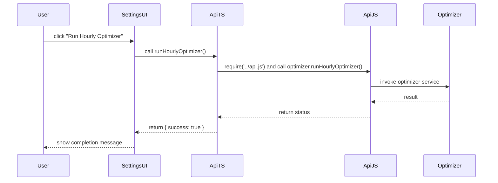

## MELCloud Optimizer — Repository Overview

This document summarises architecture, code health, migration status and product/engineering recommendations for the `com.melcloud.optimize` repository.

High-level goal: provide a compact, actionable orientation for engineers, architects and product stakeholders. It highlights the partial migration from the legacy JavaScript `api.js` to newer TypeScript sources (notably `src/api.ts`) and explains which is used at runtime today.

---

## Quick checklist (requirements coverage)
- Explore repository and explain architecture — Done
- Analyse from three perspectives (Software Architect, Developer, Product Manager) — Done
- Focus on `api.js` vs `src/api.ts` usage & migration state — Done
- Produce Markdown file with Mermaid diagrams, actionable insights and questions — Done

---

## TL;DR summary
- The codebase is a Homey app (Node/CommonJS) migrated partially to TypeScript. The runtime entrypoints and many modules still require a JavaScript compatibility layer: `api.js` is the central, legacy API/orchestration module and is required from multiple TypeScript files (e.g. `src/app.ts`, `src/api.ts`) and tests.
- `src/api.ts` implements a TypeScript `Api` class intended for the settings/UI API surface (methods like `runHourlyOptimizer`, `getMemoryUsage`, `clearHotWaterData`). It still calls into `require('../api.js')` to access runtime services, indicating a hybrid setup where TypeScript code delegates to the legacy JS orchestrator.
- Migration is therefore partial: TypeScript added for clarity and safety, but `api.js` remains the authoritative runtime orchestrator.

Implication: either keep the JS compatibility shim in place (and keep TypeScript small/adapters) or fully migrate `api.js` into `src/` TypeScript and provide a JS-compatible build artifact. The current hybrid increases cognitive load and risk of runtime mismatches.

---

## High-level architecture

Mermaid: component diagram (system overview)

```mermaid
flowchart LR
  UI[Settings / Web UI / Homey Settings]
  subgraph HomeyApp[Homey App (this repo)]
    direction TB
    App[src/app.ts]
    ApiTS[src/api.ts]
    ApiJS[api.js]
    Services[TypeScript services]
    Drivers[drivers/*]
    Helpers[utils/*, timeline-helper-wrapper.js]
  end

  UI -->|calls| ApiTS
  ApiTS -->|requires| ApiJS
  App -->|requires| ApiJS
  ApiJS -->|orchestrates| Services
  ApiJS -->|calls| Helpers
  App --> Drivers
  Services -->|network| MELCloud[MELCloud API]
  Services -->|network| Tibber[Tibber API]

  style ApiJS fill:#ffe4b5,stroke:#333
  style ApiTS fill:#e6f0ff,stroke:#333
```

Notes:
- `ApiJS` is currently a monolithic orchestrator: contains MELCloud/Tibber helper classes, HTTP retry logic, device extractors, and wrappers for thermal-model and optimizer. It also contains compatibility shims to interact with TypeScript services.
- `ApiTS` (in `src/api.ts`) is a small TypeScript API class that provides safe, typed endpoints used by settings/UI. It still imports `api.js` using CommonJS `require`.

---

## Control / request flow (example: settings button -> run optimizer)



---

## Migration status — `api.js` vs `src/api.ts`
- `api.js` (root): large, feature-rich JS module. Acts as single entry point for runtime functionality and orchestrates services (MELCloud, Tibber, thermal-model, optimizer, hot-water). Many helper functions and direct HTTP calls live here.
- `src/api.ts`: TypeScript class exposing typed methods for the settings API. It uses `require('../api.js')` to access runtime state (e.g. optimizer instance, thermalModelService).
- References: `src/app.ts` and multiple source files call `require('../api.js')` — tests also mock/require `api.js` (so tests expect it to exist and export the runtime API object).

Conclusion: runtime behavior is controlled by `api.js`. `src/api.ts` is primarily a typed adaptor used by the UI/settings. A full migration requires either:
- Option A (recommended for long-term): Convert `api.js` into TypeScript under `src/` (split responsibilities into services) and produce a compiled JS artifact at repo root for backward compatibility (or update require paths). This keeps a single source-of-truth and enables strict typing and safer refactors.
- Option B (short-term): Keep `api.js` as orchestrator and treat `src/` as incremental typed layers; ensure build produces a stable compatibility shim and add clear developer docs about the hybrid architecture.

---

## Perspectives

### Software Architect — system design & scalability
- Pattern: monolithic orchestrator (`api.js`) + modular services. The orchestrator holds multiple concerns (HTTP, caching, retry logic, device extraction, service lifecycle). This centralization simplifies cross-service calls but increases coupling and reduces testability.
- Scalability concerns:
  - Single-process memory usage: repository contains MEMORY_MANAGEMENT_ANALYSIS.md and explicit memory-usage endpoints indicating previous memory pressure.
  - Long-running timers and reconnects in `MelCloudApi` (reconnectTimers) require careful cleanup to avoid leaks.
  - Network-heavy operations (MELCloud/Tibber) have retry logic — good — but centralizing them makes it harder to horizontally scale or split responsibilities.
- Recommendations:
  - Extract services into modules with clear interfaces (MelCloudApi, TibberApi, ThermalModelService, HotWaterService, Optimizer) and register them with a lightweight DI/registry.
  - Adopt a lifecycle manager: start/stop services, and ensure timers/intervals are cancellable and tested.
  - If future scaling is needed (more data processing or heavier thermal-model work), separate compute-heavy work into worker processes or schedule jobs externally.

### Software Developer — code structure & maintainability
- Strengths:
  - Incremental TypeScript adoption improves safety where used (e.g. `src/api.ts`, many services under `src/`).
  - Tests exist (unit and integration). Coverage artifacts present in `coverage/`.
- Issues:
  - Duplication and split ownership: logic exists both in `api.js` and compiled `.homeybuild`/coverage artifacts; it's not obvious where to change code safely without breaking requires.
  - `api.js` is large and lacks strong type safety; many utility functions, retry logic, and device parsing live in a single file.
  - Some modules use `require('../api.js')` (CommonJS) while project compiles TypeScript to `.homeybuild` — mixture of module systems complicates builds.
- Quick wins:
  - Add a small adapter module (e.g. `src/api-compat.ts`) that imports the TypeScript implementations and exports a JS-compatible API object; keep `api.js` as a thin shim requiring that adapter. This reduces the surface area of the legacy file and centralizes new code in `src/`.
  - Add linting/formatting + incremental TS types for core services. Add or enable ESLint + type-aware rules.
  - Add small unit tests for service boundaries and memory leak tests for lifecycle.

### Product Manager — feature & UX evaluation
- Core value: automates heat pump optimization and provides energy savings and calibration tools; integrates MELCloud and Tibber.
- Visible/usable features (from code):
  - Hourly optimizer and scheduled workflows
  - Thermal model with cleanup utilities
  - Hot water usage pattern detection and reset/clear
  - Memory usage diagnostics and maintenance API endpoints
- Opportunities & questions:
  - Can we expose a lightweight dashboard in the settings to visualize optimizer results and recent savings? (Low-effort: reuse existing `enhanced-savings-calculator.ts` and add an HTML settings page.)
  - Are the default settings and onboarding clear for the average user (non-technical)? Consider a guided setup to connect MELCloud/Tibber and explain what optimizer changes will be made.
  - Consider adding telemetry (opt-in) for optimizer accuracy and anonymized savings metrics to prioritize improvements.

---

## Contract (for `Api` surface implemented in `src/api.ts`)
- Inputs: UI/settings calls (no-auth internal Homey endpoints). Example methods: runHourlyOptimizer(), runWeeklyCalibration(), getMemoryUsage(), runThermalDataCleanup(), resetHotWaterPatterns(), clearHotWaterData({ clearAggregated }).
- Outputs: standard JSON objects { success: boolean, message?: string, ...data }
- Error modes: return success: false with message; exceptions logged via app.error and converted to message string.

Edge cases to test:
- Hot water service missing (ensure API returns friendly error and does not throw)
- Thermal model absent or not yet initialized when calling cleanup
- Memory usage when thermal model is doing heavy computation

---

## Actionable recommendations (short / medium / long term)

Short-term (safe, low risk)
- Add `OVERVIEW.md` (this file). Document the hybrid architecture in the README and mention where to change code.
- Create a tiny compatibility adapter `src/api-compat.ts` that centralizes the `module.exports = { optimizer, ... }` surface for `api.js` to require. Make `api.js` a thin wrapper that only re-exports that adapter. This clarifies the migration path.
- Add a CONTRIBUTING.md with build/test instructions and mention that tests mock `api.js`.

Medium-term
- Migrate `api.js` into TypeScript: split into service modules under `src/services/` and keep a small root `src/api/index.ts` that re-exports a JS-compatible object for runtime.
- Add ESLint + Prettier configuration and a CI job (GitHub Actions) that builds TypeScript and runs tests.
- Add typed interfaces for critical services (IMelCloudApi, ITibberApi, IOptimizer) and unit tests for their behaviors.

Long-term
- Consider service decomposition: run heavy thermal-model workloads in a worker/child process or offload to a scheduled background job to reduce memory pressure in the main Homey process.
- Add an optional usage telemetry pipeline (opt-in). Use metrics to improve optimizer heuristics.

---

## Notable files & suggested next edits
- `api.js` — central orchestrator (legacy). Candidate for migration.
- `src/api.ts` — typed API surface for settings; currently delegates to `api.js`.
- `src/app.ts` — app entry/lifecycle; several places `require('../api.js')`.
- `src/services/*`, `drivers/*` — domain-specific components.

Suggested immediate PR: Add `src/api-compat.ts` and modify `api.js` to require that adapter (thin shim). This gives a single TypeScript place to add new runtime behavior while keeping the root compatibility stable.

---

## Developer notes — how to run & test locally
Build TypeScript and run tests:

```bash
# install deps
npm install

# build ts to .homeybuild
npm run build:ts

# run tests
npm test
```

Note: tests mock or require `api.js` — don't remove or rename `api.js` until you provide a compatibility shim.

---

## Open questions for maintainers (actions to decide)
1. Target: full TypeScript migration, or maintain hybrid with a compatibility shim?
2. If migrating, do we want to keep the same runtime shape (single process) or split heavy workloads into workers?
3. Who will own the refactor and what is the acceptable risk window for end users (some behavior could change subtly when reimplementing device extraction logic)?

---

## Closing / summary
The repository contains a powerful and useful Homey app with a clear value proposition. The partial migration to TypeScript is a positive step, but the coexistence of a large legacy `api.js` with TypeScript services introduces maintainability risk. Follow the short-term compatibility adapter approach to reduce risk, then plan a staged migration to TypeScript with clear service boundaries and lifecycle management.

If you'd like, I can implement the recommended small compatibility adapter (`src/api-compat.ts`) and change `api.js` into a thin shim that requires it — this will keep runtime stable while consolidating new code under `src/`.
