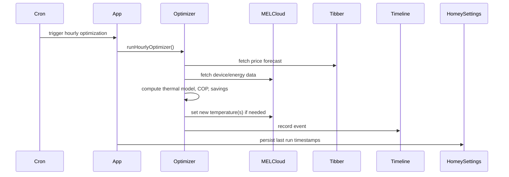
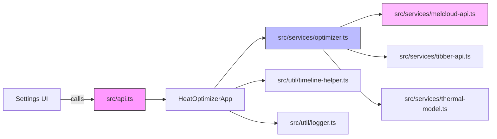

# MELCloud Optimizer — Repository Overview

Last scanned: 2025-08-23

This document summarizes the repository from three perspectives: Software Architect, Software Developer, and Product Manager. It highlights system architecture, current implementation notes, legacy overlap (JS vs TS), risks, and prioritized, actionable improvements developers can take next.

## Quick checklist (requirements from the task)

- [x] Repository scanned (core manifests and representative source files)
- [x] System architecture explained with Mermaid diagrams
- [x] Findings organized by Software Architect, Developer, and Product Manager
- [x] Legacy/JS vs TS overlap identified and actionable recommendations provided
- [x] Actionable next steps and questions for further work


## What I scanned

Representative files used to build this overview:

- `package.json`
- `tsconfig.json`
- `README.txt`
- `src/app.ts`
- `src/api.ts`
- `src/services/melcloud-api.ts`
- `src/services/optimizer.ts`
- `api.js` (legacy JS)
- `lib/constants.js` (appears empty)
- `lib/services/melcloud-api.js` (appears empty)
- Tests: many files under `test/`, `test/unit/`, `test/integration/`, `unit/`

Note: repository contains both TypeScript sources under `src/` and legacy JavaScript files at the repo root and in `lib/`. There are many tests present using `jest`.


## High-level summary

MELCloud Optimizer is a Homey application that connects to Mitsubishi MELCloud and Tibber, learns thermal characteristics of the home, and optimizes heat pump and hot water schedules to save electricity cost while maintaining comfort. The codebase is predominantly TypeScript (modern), with some legacy JavaScript modules (older API implementations or wrappers) still present.


## System architecture (conceptual)

```mermaid
flowchart LR
  subgraph Homey App
    App[HeatOptimizerApp<br/>(src/app.ts)]
    Cron[Hourly / Weekly Cron Jobs]
    API[src/api.ts]
    Timeline[TimelineHelper]
    Logger[HomeyLogger]
    HotWater[HotWaterService]
    COP[COPHelper]
    OptimizerSvc[Optimizer Service]
  end

  subgraph External Services
    MEL[MELCloud API]
    TIB[Tibber Price API]
    Weather[Weather API]
  end

  App --> Cron
  App --> API
  App --> Logger
  App --> Timeline
  App --> HotWater
  App --> COP
  App --> OptimizerSvc
  OptimizerSvc --> MEL
  OptimizerSvc --> TIB
  OptimizerSvc --> Weather
  API -->|settings UI / user calls| App
  MEL -. HTTP .-> MELCloud[https://app.melcloud.com]
  TIB -. HTTP .-> Tibber[https://api.tibber.com]
```


## Hourly optimization workflow (simplified)




## Findings — Software Architect

Strengths

- Clear modular separation of concerns: app orchestration (`src/app.ts`), optimization logic (`src/services/optimizer.ts`), MELCloud API wrapper (`src/services/melcloud-api.ts`), helper modules (COP, timeline, hot-water).
- Uses Homey platform concepts (settings, timeline, flows) and Cron for schedulers.
- Thermal learning and enhanced-savings logic are present—good for product differentiation.
- Tests are present (unit and integration) showing investment in quality.

Weaknesses / architectural risks

- Mixed codebase: TypeScript sources in `src/` but legacy JavaScript implementations remain (`api.js`, `lib/...`). This creates potential duplication of logic, confusion about canonical implementations, and harder builds for contributors.
- Runtime coupling to compiled JS: some runtime code (API routes, or other modules) may `require('../api.js')` or rely on compiled artifacts. That can create subtle build ordering issues (must ensure TS is built before running app if runtime expects JS files).
- Time zone handling is custom and ad-hoc in several places. DST handling is simplified and may be incorrect edge-case-wise.
- Long-running timers / reconnect logic: reconnect timers are stored and cleared manually; careful resource cleanup is required to avoid leaks in long-running Homey apps.
- No centralized error/observability exports (some error handlers exist, but integration with a monitoring service is not present). For devices in the field, improved telemetry would help.

Scalability

- The app is primarily single-instance within a Homey device; scalability is less about horizontal scaling and more about memory/CPU reliability. CPU-heavy computations (learning model) may need rate-limiting or throttling to avoid blocking event loop.
- Network resiliency: MELCloud uses throttling / retry / circuit-breaker patterns in TypeScript service — good. Ensure these are consistently applied across wrappers.


## Findings — Software Developer

Code quality & maintainability

- TypeScript adoption with strict settings in `tsconfig.json` is good: strict mode is enabled which increases type safety.
- Files like `src/services/melcloud-api.ts` show good practices: circuit breaker, throttling, request deduplication, retry/backoff and structured error handling.
- `src/services/optimizer.ts` is large and contains a lot of domain logic and defaults. Consider breaking it into smaller modules (thermal-model, hot-water-strategy, pricing-strategy) for testability.

Legacy overlap / duplication (examples found)

- `src/api.ts` (TypeScript) — main API class. But a large `api.js` exists at repo root which implements similar responsibilities (wrapper implementations for HTTP/TL). `api.js` is heavy (many functions) and likely a legacy artefact from before TS migration.
- `lib/services/melcloud-api.js` and `lib/constants.js` present but empty — likely placeholders or partially-cleaned legacy files.
- Some `*-wrapper.js` files exist (e.g., `timeline-helper-wrapper.js`, `enhanced-savings-calculator-wrapper.js`) — wrappers might duplicate logic between TS and JS layers.

Actionable developer notes (concrete)

1. Inventory duplication: make a simple map of responsibilities — for each service (MELCloud, Tibber, Timeline, Logger, HotWater) identify the authoritative implementation (TS source in `src/services` or JS in root/lib). Prefer the TS implementation as canonical if it is complete.
2. If `api.js` is still required at runtime (for compiled SDK compatibility), prefer a small, well-documented compatibility shim that imports the compiled TS outputs rather than containing a parallel implementation.
3. Split `src/services/optimizer.ts` into smaller modules: pricing, thermal-model, hot-water scheduler, COP scoring. Add unit tests for each piece.
4. Add linter (ESLint with TypeScript plugin) and Prettier to enforce consistent formatting and catch common issues.
5. Add lightweight static analysis / type coverage checks as part of CI (e.g., run `tsc --noEmit` in CI).
6. Audit long-lived timers and ensure there are tests that call cleanup functions (`cleanupCronJobs`) to prevent leaks.

Tests & CI

- There are extensive Jest tests. Ensure the CI runs `npm run test:ci` and `npm run build:ts` in a known order. Consider adding GitHub Actions to run lint, typecheck, and tests on PRs.


## Findings — Product Manager

Feature alignment & user flows

- The app solves a clear problem: reduce energy costs by shifting heat-pump usage to cheaper hours while maintaining comfort.
- Key user-facing features: scheduled hourly optimization, weekly calibration, hot water pattern learning, timeline notifications, settings UI.
- There is an API surface that the settings UI uses. `src/api.ts` exposes run/cleanup functions and memory/cleanup utilities — good for admin/advanced users.

Usability & gaps

- Time zone / DST handling may surprise users in edge regions; add a clear UI hint and unit tests around DST transitions.
- Settings validation is present but could provide more user-friendly messages in the UI (e.g., expected range for K-factor or temperature constraints).
- Logs/timeline entries: timeline helper exists, but fallback branches use diverse Homey APIs. Confirm which Homey versions are targeted and ensure the UI behaves consistently across Homey Pro/Cloud.

Product opportunities

- Add an onboarding flow: verify MELCloud and Tibber credentials, fetch devices, show recommended defaults (thermal K/S) and an estimate of expected monthly saving.
- Add an A/B style telemetry opt-in to measure actual savings vs baseline for consenting users.
- Surface a "confidence" and "expected savings" in the settings UI when suggesting temperature changes so users understand risk vs reward.


## Legacy & unused code — recommendations

Observed legacy or suspicious files:

- `/api.js` — large legacy JS implementation that overlaps behavior with `src/api.ts` and `src/services/*.ts`.
- `lib/constants.js`, `lib/services/melcloud-api.js` — appear empty or placeholder.
- Several wrapper JS files in repo root: `timeline-helper-wrapper.js`, `enhanced-savings-calculator-wrapper.js`, `improvments.md` (typoed), etc.

Suggested actions

1. Create a "canonicalization" branch and produce a short mapping document: for each service name list the TS file (if present) and the JS file (if present) and mark which should be kept. This prevents accidental deletes.
2. If the TypeScript code is complete and well-tested, remove or archive legacy JS implementations. If runtime consumers still require JS artifacts, produce compiled JS from TS into a single `dist/` or `.homeybuild/` and reference that, instead of maintaining parallel sources.
3. Add a `DEPRECATION.md` or `LEGACY.md` describing what to remove and when.


## Prioritized actionable improvements (short-term → mid-term → long-term)

Short-term (low friction, high ROI)

- Add ESLint + Prettier and a basic GitHub Action that runs `npm run build:ts` and `npm test` on PRs.
- Add a small script that lints for duplicate JS/TS services and prints a report to help cleanup.
- Replace ad-hoc DST logic with a well-tested timezone library call (the project already depends on `luxon` — centralize time handling using Luxon throughout).
- Add unit tests for critical cleanup methods (cron cleanup, reconnect timer cleanup).

Mid-term

- Consolidate service implementations: migrate any remaining behavior in `api.js` into TS (or convert into a compatibility shim that imports from compiled TS output) and remove legacy code.
- Extract `src/services/optimizer.ts` into smaller modules and add focused unit tests per module (thermal model, pricing strategy, hot water scheduler).
- Improve memory safety: review `pendingRequests` and `reconnectTimers` usage and add monitoring/logging for growth.

Long-term / strategic

- Add opt-in telemetry to measure real savings in real-world usage (with privacy-preserving defaults).
- Add a minimal CI pipeline with canary releases or staged rollouts (if applicable for Homey app distribution).
- Consider refactoring heavy computation into a worker (if Homey environment supports) or throttling expensive operations during peak UI operations.


## Developer checklist to start cleanup (exact steps)

1. Create a branch `cleanup/ts-canonicalization`.
2. Run `npm run build:ts` and run tests locally: `npm run test:unit`.
3. Produce a file `LEGACY_MAP.md` listing each JS file that implements service logic and the corresponding TS file. Example header:
   - `api.js` -> `src/api.ts` (duplicate?)
   - `lib/services/melcloud-api.js` -> `src/services/melcloud-api.ts` (lib one empty)
4. Decide canonical files (prefer `src/*.ts`) and create a small compat shim `bin/compat-api.js` that simply `require('./.homeybuild/src/api.js')` or exports compiled TS outputs.
5. Remove legacy code in a follow-up PR once the shim is validated and tests pass.


## Risks & open questions

- Is `api.js` still used at runtime by any external tooling or by the Homey packaging pipeline? (It uses CommonJS requires and may be the legacy export that settings UI calls.)
- Are all tests green when compiling TypeScript first and then running Jest? (CI ordering must run a build step before tests if tests import compiled JS in `api.js`.)
- Are credentials (MELCloud email/password, Tibber token) stored in Homey settings plain-text? If so, consider mitigations (rotate tokens, limit scope, or store secrets in Homey secure store if available).


## Useful quick wins (code pointers)

- Consolidate time handling by using `luxon` consistently instead of custom DST heuristics seen in `src/app.ts` and `api.js`.
- Move network logic into a single well-tested HTTP wrapper. `src/services/melcloud-api.ts` already uses Node `https` and good retry/circuit-breaker logic — standardize other services to reuse that wrapper.
- Add docstrings and a small architecture diagram (this file) into `README.md` so new contributors can onboard faster.


## Sample Mermaid: component dependency (detailed)




## Final notes & next steps for you

- I created this `OVERVIEW.md` to centralize findings and suggested next steps.
- I recommend starting with the short-term items (ESLint, centralized time handling, tests for cleanup). After that, do a canonicalization mapping of TS vs JS files and prepare a small compat shim before deleting legacy code.

If you want, I can now:

- Produce the `LEGACY_MAP.md` automatically by scanning the workspace for JS files that mirror TS services and emit a suggested mapping.
- Open a PR that adds ESLint + a GitHub Actions workflow with `build + test` steps.

Tell me which of the two you'd like me to do next and I will start immediately.
