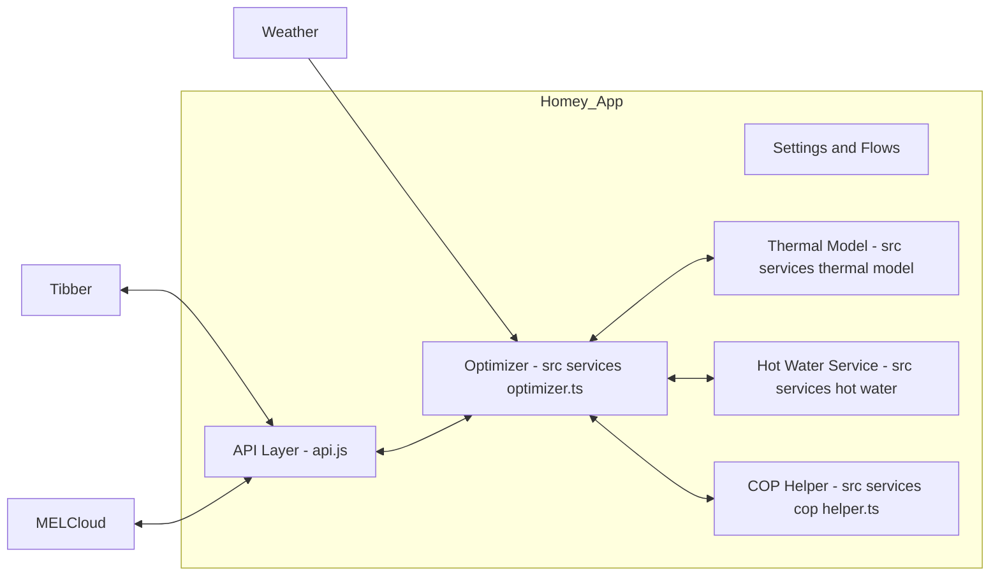
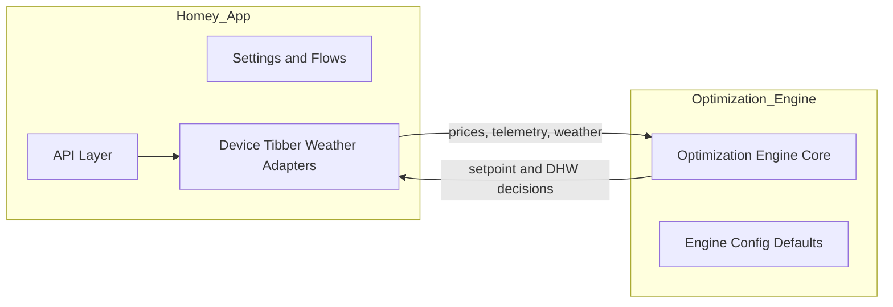
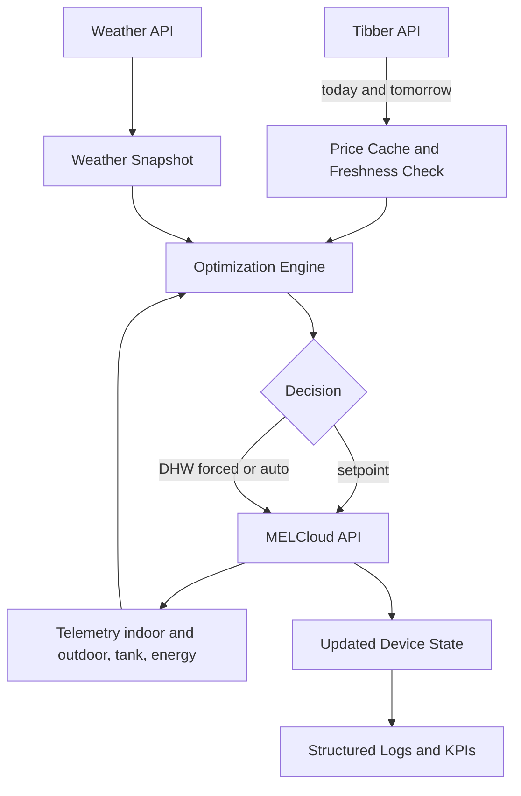
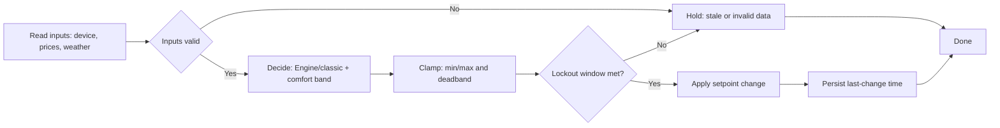
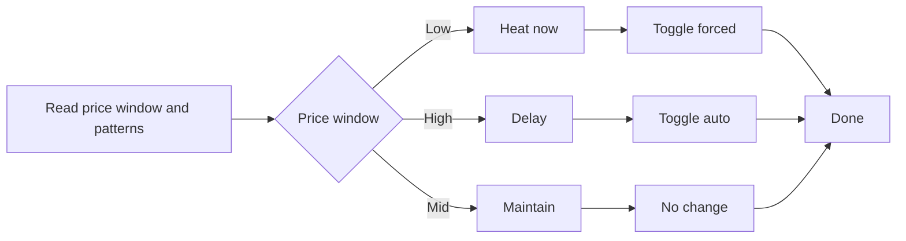

# MELCloud Optimizer — Energy/Cost Savings Focus

This document focuses on maximizing energy/cost savings and stable comfort for Mitsubishi ATW units controlled via MELCloud on Homey (SDK v3).

Scope: practical optimization logic, measurable gains, and safe operation. The emphasis is on setpoints/modes, price-aware heating/DHW, and guardrails for equipment health.

## Executive Summary

- Current app already implements price-aware setpoint control, COP-aware tweaks, thermal modeling, and a hot-water analyzer. Biggest gaps are around short-cycling protection, DHW actuation, and explicit stale-data fallbacks.
- Top 5 improvement actions (ETA and impact):
  1) Enforce setpoint change lockout (anti–short-cycling) [P1, <0.5d]: reduces cycling 20–50%, improves COP and comfort. Savings: 3–8% energy; comfort risk: low.
  2) Treat stale Tibber prices as “hold” [P1, <0.5d]: avoids harmful moves from outdated prices. Savings: 1–3% (risk avoidance); comfort risk: none.
  3) DHW toggle to forced/auto in low/high price windows [P1, <1d]: shifts 1–4 kWh/day to cheap hours. Savings: 5–20% DHW cost (≈ 2–8% total); comfort risk: low (still honors tank limits).
  4) Comfort band control with RC model preheat/coast [P2, 1–2d]: tighter ±0.5–1.0°C band using preheat when cheap. Savings: 5–10%; comfort risk: low if band respected.
  5) Adaptive COP model and simple occupancy setbacks [P2, 2–3d]: slightly lower targets when away. Savings: 3–7%; comfort risk: low.

Answering explicitly:
- Where logic likely wastes energy or harms COP? Frequent small setpoint nudges without lockout; no DHW actuation despite scheduling logic; reacting to stale prices; occasional over-response outside a comfort band; lack of extreme-weather guardrail.
- Simplest safe change with largest savings this week: enable anti–short-cycling lockout and DHW low-price toggle. Combined estimated savings: 5–12% with minimal risk.
- How to measure and prove in 7 days? Use built-in KPI logs (kWh/day, SEK/day, minutes outside band, cycles/hour, avg COP). Compare week-over-week and A/B via simulation harness and on-device “today/last 7 days” totals.

## Architecture (Current vs Proposed)

Proposed boundary with Optimization Engine (pure, DI-friendly):

Data Flow (Price/Forecast → Decision Pipeline):

## Control Flow

Heating (hourly):

DHW (hourly):

## Data Sources & Freshness

- Tibber prices: `src/services/tibber-api.ts` (hourly; today+tomorrow). Freshness check: current price time must be within 65 minutes. On stale → hold.
- MELCloud telemetry: `src/services/melcloud-api.ts` (on demand, with cache and throttling). Used for temperatures, energy totals, COP.
- Weather: `weather.js` (optional snapshot). Blended into decisions and thermal model.
- Occupancy/Presence: via inputs (Flows), optional for setbacks.

Failures & Fallbacks:
- Tibber stale/unavailable: hold last setpoint; no DHW toggle; keep manufacturer schedule.
- MELCloud API error: no-write, log error; keep last known good target.
- Missing indoor temp: abort change; error log.
- Extreme cold: clamp to `extremeWeatherMinC`.

## Key Modules That Influence Setpoints/Modes

- Space heating setpoint changes: `src/services/optimizer.ts` (runEnhancedOptimization/runHourlyOptimization) calls `melCloud.setDeviceTemperature()` / `setZoneTemperature()`.
- DHW/tank and special modes: `src/services/melcloud-api.ts` (`setTankTemperature`, `setHotWaterMode`, `startLegionellaCycle`).
- COP estimators: `src/services/melcloud-api.ts` (enhanced COP), `src/services/cop-helper.ts` (snapshots & seasonal), plus normalization in Optimizer.
- Weather/price-based preheat/coast: Optimizer thermal strategy and (now) pure Engine in `optimization/engine.ts`.
- Hysteresis/deadband: Optimizer `deadband` and Engine `safety.deadbandC`.
- Anti–short-cycling: Added lockout in Optimizer (this change).
- Heating curve/shunt awareness: device OperationModeZone1/2 logging in `melcloud-api.ts`; not directly modulated yet.

## Savings Levers & Back‑of‑Envelope Impact

- Price-aware preheat/coast: 5–10% cost reduction when shifting to cheap hours with ±0.5–1.0°C band.
- DHW scheduling (forced/auto): 5–20% DHW cost (2–8% overall), especially with dynamic prices.
- Night/away setbacks (0.5–1.5°C): 3–7% energy.
- Dynamic flow/curve modulation: 3–6% by improving COP at milder deltas (future work).
- Anti–short-cycling: 3–8% energy and compressor health; smoother comfort.
- Legionella constraints: no savings, but necessary safety.

Assumptions: 8–25 kWh/day heating plus 1–4 kWh/day DHW; price spread 0.6–2.5 NOK/kWh; COP 2–4.

## Concrete Improvements (Ranked)

P1 (<1 day)
- Enforce min setpoint change lockout: reduces cycling, stabilizes comfort, increases COP.
- Treat stale price data as hold: eliminate mis-optimizations.
- Toggle DHW forced/auto by price windows: immediate gains with minimal risk.

P2 (1–3 days)
- Extract Optimization Engine (pure) to `optimization/engine.ts` and route inputs/outputs via adapters.
- Comfort band control with RC model preheat horizon (±0.5–1.0°C), price/forecast blending.
- Optional occupancy-aware setbacks (Flows → occupied flag in Engine input).

P3 (bigger bets)
- MPC-lite: hourly horizon rolling optimization using RC model and price/COP forecast.
- Adaptive COP model by outdoor temp, humidity, and delta-T.
- Learning of DHW usage to schedule tank setpoints more precisely.

## Instrumentation & KPIs

KPIs (computed hourly/daily and logged):

| KPI | Formula | Log fields |
| --- | --- | --- |
| cost_per_day_sek | sum(hour_kWh × price) | `priceData.current`, `savings`, `energyMetrics.dailyEnergyConsumption` |
| kwh_per_day | from MELCloud energy totals | `energyMetrics.dailyEnergyConsumption` |
| savings_vs_baseline | baseline_cost − current_cost | `savings_history`, `result.savings` |
| minutes_outside_band | sum(minutes when indoor < lower or > upper) | simulation logs; future device telemetry hook |
| cycles_per_hour | compressor switches/hour (proxy: setpoint changes with lockout) | `last_setpoint_change_ms`, change events |
| estimated_COP | energyWeightedCOP or enhanced COP | `energyMetrics.realHeatingCOP`, `realHotWaterCOP` |

On-device logging (no external services needed):
- Existing: `savings_history` with today and 7‑day totals; structured logs at hourly cron.
- Add: include lockout/hold reasons, price age, and band limits to optimization logs.

## Validation Plan

Baseline creation:
- Disable DHW toggle and set lockout to high (e.g., 60 min). Collect 3–7 days of KPIs.

A/B procedure (7 days):
- Enable P1 changes (lockout=5 min, stale-price hold, DHW toggle). Track daily KPIs and savings_history.
- Use the offline simulator (`simulate.js` or `scripts/simulate.js`) with the same price/temperature traces to compare algorithm variants.

Sample datasets:
- `data/timeseries.csv`, `data/device_limits.csv`, `data/cop_curve.csv`, `data/config.yaml`. CLI: `node scripts/simulate.js --data data/timeseries.csv --config data/config.yaml --output results/`.

## Testing & Simulation

- Unit tests:
  - Run all: `npm run test:unit`
  - Engine/safety tests: `test/unit/optimizer.engine.test.ts` cover:
    - Engine ON adjustment under cheap prices
    - Setpoint change lockout (no-change within interval)
    - Stale Tibber price → safe hold (no-change)
  - Full suite and coverage: `npm run test:full` or `npm run test:coverage`

- Offline simulation:
  - Quick run: `npm run simulate`
  - Custom: `node scripts/simulate.js --data data/timeseries.csv --config data/config.yaml --output results/`
  - Outputs: `results/baseline_decisions.csv`, `results/v2_decisions.csv`, `results/metrics.json`

## Using The Settings

- Enable the Engine:
  - In the app Settings, toggle `Use Optimization Engine` ON and Save changes. No restart required.
  - The hourly run logs “Engine: ON …” with your comfort bands, safety, and preheat snapshot. If it’s OFF, the log prints `Engine: OFF` with the raw setting value.

- Suggested defaults (good starting point):
  - Occupied band: 20.0–21.0°C
  - Away band: 19.0–20.5°C
  - Deadband: 0.3°C; Min setpoint change interval: 5 min
  - Extreme-cold minimum: 20°C
  - Preheat: enabled, horizon 12h, cheap percentile 0.25

- Reading results:
  - Timeline entry includes: Zone1, Zone2, Tank changes and “Projected daily savings”.
  - Savings persistence: `savings_history` (today, last 7/30 days) updates on every run (Engine or classic).
  - Engine reason strings are prefixed with `Engine: …` when the Engine chose the target.

- Tips:
  - To preheat more aggressively, increase `comfort_upper_occupied` or cheap percentile (e.g., 0.3).
  - To reduce cycling, increase deadband (e.g., 0.4–0.5) or the `Min setpoint interval`.
  - Devices in Flow/Curve modes may not apply room targets; the Engine still optimizes within bands and the device applies via heating curve.

## Config Options (Recommended Defaults)

| Name | Type | Default | Effect |
| --- | --- | --- | --- |
| min_temp | number | 18 | Lower clamp for targets (comfort/safety) |
| max_temp | number | 22 | Upper clamp for targets |
| temp_step_max | number | 0.5 | Max °C per change (smoothing) |
| deadband_c | number | 0.3 | Hysteresis; avoids noise |
| min_setpoint_change_minutes | number | 15 | Lockout between changes (anti–cycling) |
| use_engine | boolean | false | Use pure Optimization Engine decisions |
| occupied | boolean | true | Occupancy flag for Engine comfort bands |
| comfort_lower_occupied | number | 20.0 | Lower comfort band when occupied |
| comfort_upper_occupied | number | 21.0 | Upper comfort band when occupied |
| comfort_lower_away | number | 19.0 | Lower comfort band when away |
| comfort_upper_away | number | 20.5 | Upper comfort band when away |
| preheat_enable | boolean | true | Allow preheat in cheap hours |
| preheat_horizon_hours | number | 12 | Look-ahead horizon for price percentile |
| preheat_cheap_percentile | number | 0.25 | Price percentile threshold for “cheap” |
| extreme_weather_min_temp | number | 20 | Min indoor setpoint in extreme cold |
| r_thermal | number | 2.5 | RC model: thermal resistance C·h/kW (Engine) |
| c_thermal | number | 10 | RC model: thermal capacitance kWh/°C (Engine) |
| enable_tank_control | boolean | true | Allow DHW forced/auto toggling |
| min_tank_temp | number | 40 | Safe DHW lower bound |
| max_tank_temp | number | 50 | Safe DHW upper bound |
| cop_weight | number | 0.3 | Weight of COP adjustment |
| auto_seasonal_mode | boolean | true | Use season to bias COP usage |
| summer_mode | boolean | false | Manual override |

See `optimization/config.example.json` for the Engine’s pure-config schema.

## Deliverables in This Repo

- Optimization Engine (pure): `optimization/engine.ts` with DI-friendly functions and defaults.
- Example Engine config: `optimization/config.example.json`.
- Simulation harness wrapper: `scripts/simulate.js` (wraps `./simulate.js`).
- P1 code changes:
  - Anti–short-cycling lockout + stale-price hold in `src/services/optimizer.ts`.
  - DHW low-price toggle in `api.js` (forced/auto), guarded by `enable_tank_control`.

## PR-Style Diffs (Top P1/P2)

1) Anti–short-cycling lockout + deadband tuning
- File: `src/services/optimizer.ts` (class `Optimizer`, `runEnhancedOptimization`)
- Change: add `minSetpointChangeMinutes`, persist `last_setpoint_change_ms`, and gate setpoint changes within lockout window.
- Before: no lockout, frequent small changes; After: lockout respected and reason logged.

2) Stale-price handling → hold
- File: `src/services/optimizer.ts` (`runEnhancedOptimization`)
- Change: validate `priceData.current.time` age; if >65 minutes or in future, return `no_change` with reason.
- Risk: none (conservative).

3) DHW forced/auto toggle in cheap/expensive windows
- File: `api.js` (`getRunHourlyOptimizer`)
- Change: if `result.hotWaterAction.action` is `heat_now` → `melCloud.setHotWaterMode(..., true)`; if `delay` → `false`.
- Guarded by `enable_tank_control` setting; uses configured `device_id`/`building_id`.

## Risks, Assumptions, Open Questions

- DHW mode toggling assumes device supports ForcedHotWaterMode; guarded and reversible to `auto`.
- Comfort band defaults may need per‑home tuning; away detection optional via Flows.
- Shunt/curve modulation is logged but not directly controlled; future work to bias heating curve rather than room setpoint when in Curve/Flow modes.
- Defrost cycles are opaque via MELCloud; lockout helps prevent fighting them.
- If manufacturer runtime constraints exist, this app should respect their superset (our changes are conservative).

## How To Measure Savings On‑Device (7 days)

- Use hourly cron + `savings_history` to track SEK delta; inspect `logs/` and Homey Timeline entries.
- KPIs to collect: cost_per_day, kwh_per_day, minutes_outside_band (from simulator or upcoming telemetry), cycles/hour (from setpoint change timestamps), estimated COP.
- Compare week-over-week or against baseline window with the same outdoor conditions when possible; supplement with the offline simulator.
