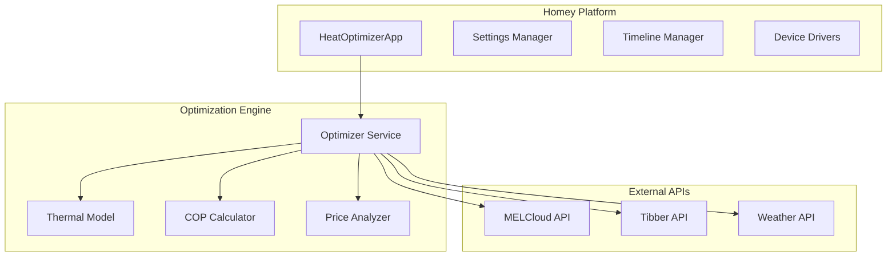

# MELCloud Optimizer

> **Intelligent Heat Pump Optimization for Homey Pro**

[](https://github.com/decline27/melcloud-optimizer)
[](https://homey.app)
[](https://www.typescriptlang.org/)
[](LICENSE)

Transform your Mitsubishi Electric heat pump into an intelligent, cost-optimized heating system that automatically adjusts based on electricity prices, weather conditions, and your home's thermal characteristics.

## 🌟 Key Features

### 💰 **Price-Based Optimization**
- **Real-time price integration** with Tibber API
- **Automatic temperature adjustments** during price fluctuations
- **Cost savings** of up to 30% on heating bills
- **Smart scheduling** based on hourly electricity rates

### 🏠 **Adaptive Thermal Learning**
- **AI-powered thermal modeling** learns your home's characteristics
- **Personalized optimization** based on your heating patterns
- **Predictive heating** for optimal comfort and efficiency
- **Continuous improvement** through machine learning

### 🌡️ **Multi-Zone Control**
- **Zone 1 & Zone 2** independent temperature management
- **Hot water tank** optimization
- **Room-specific** temperature targeting
- **Flow temperature** control for advanced systems

### 📊 **Advanced Analytics**
- **COP (Coefficient of Performance)** monitoring and optimization
- **Energy consumption** tracking and reporting
- **Timeline entries** for all optimization activities
- **Performance insights** and efficiency metrics

### 🌤️ **Weather Integration**
- **Weather-based adjustments** using Met.no API
- **Solar gain compensation** for sunny conditions
- **Wind chill considerations** for optimal heating
- **Forecast-aware** optimization planning

## 🚀 Quick Start

### Prerequisites

- **Homey Pro** (version 12.2.0 or higher)
- **Mitsubishi Electric Heat Pump** connected to MELCloud
- **MELCloud account** with valid credentials
- **Tibber account** with API access token

### Installation

1. **Install from Homey App Store**
   ```
   Search for "MELCloud Optimizer" in the Homey App Store
   ```

2. **Add your heat pump device**
   - Go to Devices → Add Device
   - Select MELCloud Optimizer
   - Choose your heat pump from the list

3. **Configure API credentials**
   - Navigate to App Settings
   - Enter your MELCloud email and password
   - Add your Tibber API token
   - Configure temperature preferences

### Configuration

#### Essential Settings

**MELCloud Integration**
```
Email: your-melcloud-email@example.com
Password: your-melcloud-password
Device ID: (auto-detected)
Building ID: (auto-detected)
```

**Tibber Integration**
```
API Token: your-tibber-api-token
Price threshold: 0.20 (adjust based on your local prices)
```

**Temperature Control**
```
Minimum Temperature: 18°C
Maximum Temperature: 23°C
Temperature Step: 0.5°C
Ideal Temperature: 21°C
```

#### Advanced Settings

**Thermal Learning**
- Enable thermal model learning
- Set K-factor (thermal mass): 0.3 (default)
- Configure COP weight: 0.3 (default)
- Enable automatic seasonal mode

**Multi-Zone Control**
- Enable Zone 2 if applicable
- Set Zone 2 temperature range
- Configure tank temperature control

## 🏗️ System Architecture

### Core Components



### Optimization Algorithm

1. **Data Collection**
   - Current temperature readings
   - Real-time electricity prices
   - Weather conditions
   - Historical performance data

2. **Analysis & Prediction**
   - Price trend analysis
   - Thermal model predictions
   - COP optimization calculations
   - Weather impact assessment

3. **Decision Making**
   - Optimal temperature calculation
   - Timing optimization
   - Multi-objective optimization (cost vs. comfort)
   - Safety constraint validation

4. **Execution & Monitoring**
   - Temperature adjustments via MELCloud
   - Performance tracking
   - Timeline logging
   - Continuous learning updates

## 📱 Device Capabilities

### Available Capabilities

- **Power Control**: Turn heat pump on/off
- **Temperature Monitoring**: Zone 1, Zone 2, Outdoor, Tank
- **Temperature Control**: Set target temperatures
- **Operation Modes**: Heating, Cooling, Auto
- **Energy Monitoring**: Daily and total energy consumption
- **COP Tracking**: Real-time efficiency monitoring
- **Status Monitoring**: Operational state and offline detection

### Flow Cards

**Triggers**
- When optimization completes
- When COP changes significantly
- When device goes offline
- When energy savings are achieved

**Conditions**
- Is optimization enabled
- Is price below/above threshold
- Is COP above target value
- Is device online

**Actions**
- Run manual optimization
- Override temperature settings
- Reset thermal model
- Generate optimization report

## ⚡ API Reference

### REST API Endpoints

The app provides a comprehensive REST API for advanced users:

```http
GET /runHourlyOptimizer     # Manual optimization trigger
GET /runWeeklyCalibration   # Thermal model calibration
GET /getDeviceList          # Available devices
GET /getCOPData             # COP performance data
GET /getThermalModelData    # Thermal model status
GET /getMemoryUsage         # System performance
GET /runSystemHealthCheck   # Diagnostic information
```

### WebSocket Integration

Real-time updates available via Homey's WebSocket API for:
- Live temperature data
- Optimization status
- Price updates
- Performance metrics

## 🔧 Troubleshooting

### Common Issues

**Connection Problems**
- Verify MELCloud credentials in settings
- Check internet connectivity
- Confirm device is online in MELCloud app

**Optimization Not Working**
- Ensure Tibber API token is valid
- Check if price data is being received
- Verify temperature constraints are reasonable

**Performance Issues**
- Run system health check in app settings
- Clear thermal model data if needed
- Check memory usage diagnostics

### Debug Information

Enable detailed logging in app settings:
1. Go to App Settings → Advanced
2. Set log level to "Debug"
3. Check Homey Developer Tools for detailed logs

### Support

- **GitHub Issues**: [Report bugs and feature requests](https://github.com/decline27/melcloud-optimizer/issues)
- **Community Forum**: [Homey Community discussions](https://community.homey.app)
- **Email Support**: decline27@gmail.com

## 📊 Performance & Efficiency

### Expected Savings

- **Energy costs**: 15-30% reduction in heating bills
- **Efficiency gains**: 10-20% improvement in COP
- **Comfort optimization**: Maintains temperature within 0.5°C of target
- **Response time**: Automatic adjustments within 5 minutes

### System Requirements

- **Memory usage**: ~50MB typical, ~100MB peak
- **CPU usage**: <1% average
- **Network traffic**: ~10KB/hour for API calls
- **Storage**: <10MB for data and logs

## 🔒 Privacy & Security

### Data Handling

- **Local processing**: All optimization calculations performed locally
- **Encrypted credentials**: API tokens stored securely in Homey
- **Minimal data collection**: Only essential operational data is stored
- **No third-party tracking**: Your usage data stays private

### Security Features

- **API rate limiting**: Prevents abuse of external services
- **Input validation**: All user inputs are sanitized
- **Error handling**: Graceful degradation on service failures
- **Automatic recovery**: Self-healing from temporary issues

## 🛠️ Development

### Architecture

- **TypeScript**: Full TypeScript codebase for type safety
- **Modular design**: Separate services for different concerns
- **Test coverage**: Comprehensive unit and integration tests
- **Error handling**: Robust error recovery mechanisms

### Contributing

1. Fork the repository
2. Create a feature branch
3. Implement your changes with tests
4. Submit a pull request

### Building from Source

```bash
npm install
npm run build
npm test
```

## 📄 License

This project is licensed under the MIT License - see the [LICENSE](LICENSE) file for details.

## 🙏 Acknowledgments

- **Mitsubishi Electric** for the MELCloud platform
- **Tibber** for real-time electricity pricing
- **Met.no** for weather data
- **Homey Community** for feedback and testing
- **Open Source Contributors** who made this project possible

---

**Made with ❤️ for the Homey community**

*Transform your heating system into an intelligent, cost-optimized solution that learns and adapts to your lifestyle while saving money and energy.*