# MELCloud Optimizer: Memory Management Analysis & Comprehensive Technical Overview

> **A thorough investigation into memory management issues and potential memory leaks in the thermal model service, along with a complete technical analysis of the MELCloud Heat Pump Optimizer codebase**

---

## 🚨 Executive Summary - Memory Management Critical Issues

### High Priority Memory Leak Risks Identified

The thermal model service exhibits several critical memory management issues that could lead to memory leaks and degraded performance over time:

1. **Active Interval Leaks** - Multiple `setInterval` timers running indefinitely
2. **Data Accumulation** - Unbounded growth of thermal data points in memory
3. **Insufficient Cleanup** - Missing or incomplete cleanup during service shutdown
4. **High Memory Thresholds** - 80% memory usage threshold may be too high for embedded devices

---

## 🎯 Memory Management Critical Analysis

### 1. Thermal Model Service Intervals

**Location:** `src/services/thermal-model/thermal-model-service.ts`

#### Identified Memory Leaks

```typescript
// Lines 57-73: Multiple intervals created without guaranteed cleanup
this.modelUpdateInterval = setInterval(() => {
  this.updateThermalModel();
}, 6 * 60 * 60 * 1000); // Every 6 hours

this.dataCleanupInterval = setInterval(() => {
  this.cleanupOldData();
}, 12 * 60 * 60 * 1000); // Every 12 hours

// Additional setTimeout calls that may not be tracked
setTimeout(() => {
  this.updateThermalModel();
}, 30 * 60 * 1000);

setTimeout(() => {
  this.cleanupOldData();
}, 60 * 60 * 1000);
```

**Risk Level:** 🔴 **CRITICAL**
- Multiple long-running intervals
- No guaranteed cleanup on app shutdown
- Potential for orphaned timers

#### Current Cleanup Implementation

```typescript
// Lines 564-591: Cleanup exists but may not always be called
public stop(): void {
  try {
    // Clear all intervals
    if (this.dataCollectionInterval) {
      clearInterval(this.dataCollectionInterval);
      this.dataCollectionInterval = null;
    }
    if (this.modelUpdateInterval) {
      clearInterval(this.modelUpdateInterval);
      this.modelUpdateInterval = null;
    }
    if (this.dataCleanupInterval) {
      clearInterval(this.dataCleanupInterval);
      this.dataCleanupInterval = null;
    }
  } catch (error) {
    this.homey.error('Error stopping thermal model service:', error);
  }
}
```

**Issues with Current Implementation:**
- `stop()` method exists but no evidence it's called during app shutdown
- Error in cleanup could leave intervals running
- No verification that intervals are actually cleared

### 2. Data Collector Memory Issues

**Location:** `src/services/thermal-model/data-collector.ts`

#### Data Accumulation Problems

```typescript
// Lines 28-32: Configuration limits
const DEFAULT_MAX_DATA_POINTS = 2016; // ~2 weeks at 10-minute intervals
const MAX_DATA_AGE_DAYS = 30;
const MAX_SETTINGS_DATA_SIZE = 500000; // ~500KB
```

**Risk Level:** 🟡 **MEDIUM-HIGH**

#### Memory Monitoring Issues

```typescript
// Lines 300-310: High memory threshold
if (usagePercentage > 80 && !this.memoryWarningIssued) {
  this.homey.error(`High memory usage detected: ${usagePercentage}%. Triggering data cleanup.`);
  this.memoryWarningIssued = true;
  this.aggregateOlderData();
}
```

**Problems Identified:**
- 80% memory threshold is very high for embedded devices
- Only triggers warning, doesn't prevent further data collection
- No emergency stop mechanism

#### Data Persistence Issues

```typescript
// Lines 157-180: Complex serialization with circular reference handling
const dataString = JSON.stringify(this.dataPoints, (key, value) => {
  if (typeof value === 'object' && value !== null) {
    if (seen.has(value)) {
      return '[Circular]';
    }
    seen.add(value);
  }
  return value;
});
```

**Risk Level:** 🟡 **MEDIUM**
- Indicates potential circular reference issues
- Complex serialization may mask underlying object structure problems

### 3. Hot Water Service Memory Issues

**Location:** `src/services/hot-water/hot-water-service.ts`

#### Interval Management

```typescript
// Lines 16-18: Time-based collection without proper interval cleanup
private dataCollectionInterval: number = 20 * 60 * 1000; // 20 minutes
private analysisInterval: number = 6 * 60 * 60 * 1000; // 6 hours
```

**Risk Level:** 🟡 **MEDIUM**
- Uses time-based checking instead of actual intervals (lower risk)
- No cleanup mechanism visible in the service

### 4. Circuit Breaker Memory Management

**Location:** `src/util/circuit-breaker.ts`

#### Proper Cleanup Implementation (Good Example)

```typescript
// Lines 224-235: Proper cleanup implementation
cleanup(): void {
  if (this.resetTimer) {
    clearTimeout(this.resetTimer);
    this.resetTimer = null;
  }
  
  if (this.monitorTimer) {
    clearInterval(this.monitorTimer);
    this.monitorTimer = null;
  }
}
```

**Risk Level:** 🟢 **LOW**
- Proper cleanup implementation
- Used correctly in device drivers

### 5. App-Level Memory Monitoring

**Location:** `src/app.ts`

#### Memory Monitoring Implementation

```typescript
// Lines 670-685: App-level memory monitoring
private monitorMemoryUsage(): void {
  const memoryUsageInterval = setInterval(() => {
    const memoryUsage = process.memoryUsage();
    // ... memory logging
  }, 60 * 60 * 1000); // Every hour

  this.memoryUsageInterval = memoryUsageInterval;
}
```

#### Cleanup Implementation

```typescript
// Lines 1200-1205: Proper cleanup in onUninit
if (this.memoryUsageInterval) {
  this.logger.info('Cleaning up memory usage monitoring');
  clearInterval(this.memoryUsageInterval);
  this.memoryUsageInterval = undefined;
}
```

**Risk Level:** 🟢 **LOW**
- Proper cleanup implementation
- Called during app shutdown

---

## 🔧 Recommended Memory Management Fixes

### 1. Immediate Critical Fixes

#### Fix 1: Guaranteed Service Cleanup in App Shutdown

```typescript
// In app.ts onUninit method - MISSING IMPLEMENTATION
async onUninit() {
  try {
    // Add thermal model service cleanup
    if (this.thermalModelService) {
      this.thermalModelService.stop();
      this.logger.info('Thermal model service stopped');
    }

    // Add hot water service cleanup
    if (this.hotWaterService) {
      this.hotWaterService.stop(); // Need to implement this method
      this.logger.info('Hot water service stopped');
    }

    // Existing cleanup...
  } catch (error) {
    this.logger.error('Error during app shutdown:', error);
  }
}
```

#### Fix 2: Robust Interval Cleanup with Verification

```typescript
// Enhanced cleanup in thermal-model-service.ts
public stop(): void {
  const intervals = [
    { ref: this.dataCollectionInterval, name: 'dataCollection' },
    { ref: this.modelUpdateInterval, name: 'modelUpdate' },
    { ref: this.dataCleanupInterval, name: 'dataCleanup' }
  ];

  intervals.forEach(({ ref, name }) => {
    if (ref) {
      clearInterval(ref);
      this.homey.log(`${name} interval cleared`);
    }
  });

  // Force nullify all references
  this.dataCollectionInterval = null;
  this.modelUpdateInterval = null;
  this.dataCleanupInterval = null;
}
```

#### Fix 3: Lower Memory Thresholds and Emergency Stops

```typescript
// In data-collector.ts - reduce memory thresholds
if (usagePercentage > 60 && !this.memoryWarningIssued) {
  this.homey.error(`High memory usage detected: ${usagePercentage}%. Triggering data cleanup.`);
  this.memoryWarningIssued = true;
  this.aggregateOlderData();
} else if (usagePercentage > 75) {
  // Emergency stop data collection
  this.homey.error(`CRITICAL memory usage: ${usagePercentage}%. Stopping data collection.`);
  this.emergencyStop();
}
```

### 2. Data Management Improvements

#### Implement Streaming Data Processing

```typescript
// Replace in-memory accumulation with streaming processing
public addDataPoint(dataPoint: ThermalDataPoint): void {
  // Process immediately instead of accumulating
  this.processDataPointStreaming(dataPoint);
  
  // Keep only minimal working set in memory
  this.keepOnlyRecentDataPoints(100); // Keep only last 100 points
}
```

#### Implement Data Compression

```typescript
// Compress historical data before storage
private compressHistoricalData(): void {
  // Implement data compression for older data points
  // Keep only statistical summaries instead of raw data
}
```

### 3. Monitoring and Alerting

#### Enhanced Memory Monitoring

```typescript
private checkMemoryUsage(): void {
  const memoryUsage = process.memoryUsage();
  const heapUsedMB = memoryUsage.heapUsed / 1024 / 1024;
  
  // Implement multiple warning levels
  if (heapUsedMB > 50) { // Warning at 50MB
    this.homey.warn(`Memory usage warning: ${heapUsedMB.toFixed(2)}MB`);
  }
  
  if (heapUsedMB > 75) { // Critical at 75MB
    this.homey.error(`CRITICAL memory usage: ${heapUsedMB.toFixed(2)}MB`);
    this.triggerEmergencyCleanup();
  }
}
```

---

## 📊 System Architecture Overview

### Core Components Analysis

```mermaid
graph TB
    subgraph "Memory Risk Assessment"
        TMS[Thermal Model Service<br/>🔴 CRITICAL RISK]
        HWS[Hot Water Service<br/>🟡 MEDIUM RISK]
        CB[Circuit Breaker<br/>🟢 LOW RISK]
        APP[App Memory Monitor<br/>🟢 LOW RISK]
    end
    
    subgraph "Data Flow & Memory Usage"
        DC[Data Collector<br/>2016+ data points]
        TA[Thermal Analyzer<br/>Complex calculations]
        AGG[Data Aggregation<br/>Memory reduction]
    end
    
    TMS --> DC
    DC --> TA
    DC --> AGG
    TMS -.->|Memory Leak Risk| APP
```



### Service Dependencies and Memory Impact

| Service | Memory Usage | Leak Risk | Priority |
|---------|-------------|-----------|----------|
| Thermal Model Service | High (2016+ data points) | 🔴 Critical | P0 |
| Hot Water Service | Medium (usage patterns) | 🟡 Medium | P1 |
| MELCloud API | Low (transient) | 🟢 Low | P3 |
| Tibber API | Low (transient) | 🟢 Low | P3 |
| Weather API | Low (cached) | 🟢 Low | P3 |

---

## 🏗️ Technical Architecture Deep Dive

### 1. Data Flow Architecture


### 2. Memory Management Anti-Patterns Identified

#### Anti-Pattern 1: Unchecked Data Accumulation
```typescript
// Problem: Data keeps accumulating despite limits
this.dataPoints.push(dataPoint);
if (this.dataPoints.length > this.maxDataPoints) {
  // Only removes excess, but maxDataPoints is very high (2016)
  this.dataPoints = this.dataPoints.slice(-this.maxDataPoints);
}
```

#### Anti-Pattern 2: High Memory Thresholds
```typescript
// Problem: 80% memory usage is too high for embedded devices
if (usagePercentage > 80 && !this.memoryWarningIssued) {
  // By this time, device may already be struggling
}
```

#### Anti-Pattern 3: Complex Circular Reference Handling
```typescript
// Problem: Indicates underlying object structure issues
const dataString = JSON.stringify(this.dataPoints, (key, value) => {
  if (typeof value === 'object' && value !== null) {
    if (seen.has(value)) {
      return '[Circular]'; // This suggests object structure problems
    }
    seen.add(value);
  }
  return value;
});
```

### 3. Service Lifecycle Management

#### Current Implementation Issues

| Service | Initialization | Runtime | Shutdown | Risk Level |
|---------|----------------|---------|----------|------------|
| ThermalModelService | ✅ Proper | ⚠️ Intervals run indefinitely | ❌ No guaranteed cleanup | 🔴 High |
| HotWaterService | ✅ Proper | ✅ Time-based (not intervals) | ❌ No cleanup method | 🟡 Medium |
| CircuitBreaker | ✅ Proper | ✅ Proper timer management | ✅ Explicit cleanup | 🟢 Low |

---

## 🧪 Testing and Validation Strategy

### 1. Memory Leak Detection Tests

```typescript
// Proposed memory leak detection test
describe('Memory Leak Detection', () => {
  it('should not leak memory during thermal model operation', async () => {
    const initialMemory = process.memoryUsage().heapUsed;
    
    // Run thermal model for extended period
    for (let i = 0; i < 1000; i++) {
      await thermalModelService.collectDataPoint(mockDataPoint);
    }
    
    // Force garbage collection
    global.gc();
    
    const finalMemory = process.memoryUsage().heapUsed;
    const memoryIncrease = finalMemory - initialMemory;
    
    // Should not increase by more than 10MB
    expect(memoryIncrease).toBeLessThan(10 * 1024 * 1024);
  });
});
```

### 2. Interval Cleanup Verification

```typescript
// Proposed interval cleanup test
describe('Interval Cleanup', () => {
  it('should clear all intervals on service stop', () => {
    const thermalService = new ThermalModelService(mockHomey);
    
    // Track active timers before
    const timersBefore = process._getActiveHandles().length;
    
    // Stop service
    thermalService.stop();
    
    // Track active timers after
    const timersAfter = process._getActiveHandles().length;
    
    // Should have fewer or equal timers
    expect(timersAfter).toBeLessThanOrEqual(timersBefore);
  });
});
```

---

## 📈 Performance Optimization Recommendations

### 1. Memory Usage Optimization

#### Immediate Actions (P0)
- Implement guaranteed service cleanup in app shutdown
- Reduce memory usage thresholds (60% warning, 75% critical)
- Add emergency stop mechanisms for data collection

#### Short-term Improvements (P1)
- Implement streaming data processing
- Add data compression for historical data
- Optimize data structures to prevent circular references

#### Long-term Enhancements (P2)
- Implement external storage for historical data
- Add configurable memory limits based on device capabilities
- Implement predictive memory management

### 2. Data Management Strategy

```typescript
// Proposed efficient data management
class EfficientDataCollector {
  private recentData: ThermalDataPoint[] = []; // Max 100 points
  private aggregatedData: AggregatedDataPoint[] = []; // Compressed historical
  private compressionRatio: number = 10; // 10:1 compression
  
  public addDataPoint(dataPoint: ThermalDataPoint): void {
    // Add to recent data
    this.recentData.push(dataPoint);
    
    // Keep only recent data in memory
    if (this.recentData.length > 100) {
      this.compressAndArchive(this.recentData.shift()!);
    }
  }
  
  private compressAndArchive(dataPoint: ThermalDataPoint): void {
    // Convert to aggregated format, reducing memory footprint
  }
}
```

---

## 🎯 Action Plan Summary

### Immediate Critical Actions (Next 24-48 hours)

1. **🔴 P0: Implement Thermal Model Service Cleanup**
   - Add `thermalModelService.stop()` call to app `onUninit`
   - Verify all intervals are properly cleared
   - Add error handling for cleanup failures

2. **🔴 P0: Reduce Memory Thresholds**
   - Change warning threshold from 80% to 60%
   - Add critical threshold at 75% with emergency stop
   - Implement immediate data reduction on critical threshold

3. **🔴 P0: Add Hot Water Service Cleanup**
   - Implement `stop()` method in HotWaterService
   - Ensure cleanup is called during app shutdown

### Short-term Improvements (Next 1-2 weeks)

4. **🟡 P1: Enhanced Memory Monitoring**
   - Implement multi-level memory warnings
   - Add memory usage trending and prediction
   - Create alerts for memory growth patterns

5. **🟡 P1: Data Structure Optimization**
   - Investigate and fix circular reference issues
   - Optimize data point structure for memory efficiency
   - Implement data compression for historical data

### Long-term Optimizations (Next 1-2 months)

6. **🟢 P2: Streaming Data Architecture**
   - Replace in-memory accumulation with streaming processing
   - Implement external storage for historical data
   - Add configurable memory limits

7. **🟢 P2: Comprehensive Testing**
   - Add memory leak detection tests
   - Implement interval cleanup verification
   - Add performance benchmarking

---

## 📋 Risk Assessment Matrix

| Risk Factor | Likelihood | Impact | Risk Level | Mitigation Priority |
|-------------|------------|--------|------------|-------------------|
| Thermal Model Interval Leaks | High | High | 🔴 Critical | P0 - Immediate |
| Data Accumulation Growth | Medium | High | 🟡 High | P0 - Immediate |
| Hot Water Service Leaks | Medium | Medium | 🟡 Medium | P1 - Short-term |
| Circuit Breaker Issues | Low | Low | 🟢 Low | P3 - Monitor |
| App Memory Monitor Issues | Low | Low | 🟢 Low | P3 - Monitor |

---

## 🔍 Technical Debt Analysis

### Code Quality Issues Related to Memory Management

1. **Inconsistent Cleanup Patterns**
   - Some services have cleanup, others don't
   - No standardized lifecycle management
   - Error handling varies across services

2. **Complex Data Structures**
   - Circular reference handling suggests architectural issues
   - Over-engineered aggregation system
   - Multiple storage mechanisms (settings, files, memory)

3. **Missing Observability**
   - Limited memory usage tracking
   - No trending or prediction capabilities
   - Insufficient alerting mechanisms

### Recommended Architectural Improvements

1. **Standardize Service Lifecycle**
   ```typescript
   interface ServiceLifecycle {
     start(): Promise<void>;
     stop(): Promise<void>;
     getStatus(): ServiceStatus;
     getMemoryUsage(): MemoryStats;
   }
   ```

2. **Implement Central Resource Manager**
   ```typescript
   class ResourceManager {
     private services: ServiceLifecycle[] = [];
     
     public register(service: ServiceLifecycle): void;
     public stopAll(): Promise<void>;
     public getOverallMemoryUsage(): MemoryStats;
   }
   ```

3. **Add Comprehensive Monitoring**
   ```typescript
   class MemoryMonitor {
     private thresholds: MemoryThreshold[];
     private alerts: AlertManager;
     
     public monitor(): void;
     public predict(): MemoryTrend;
     public emergencyCleanup(): Promise<void>;
   }
   ```

---

## 🚀 Implementation Roadmap

### Phase 1: Critical Memory Leak Fixes (Week 1)
- [ ] Implement thermal model service cleanup in app shutdown
- [ ] Add hot water service cleanup mechanism
- [ ] Reduce memory thresholds and add emergency stops
- [ ] Add comprehensive interval cleanup verification

### Phase 2: Enhanced Monitoring (Week 2-3)
- [ ] Implement multi-level memory warnings
- [ ] Add memory usage trending
- [ ] Create automated alerts for memory issues
- [ ] Add memory leak detection tests

### Phase 3: Architectural Improvements (Week 4-6)
- [ ] Standardize service lifecycle management
- [ ] Implement central resource manager
- [ ] Optimize data structures and eliminate circular references
- [ ] Add streaming data processing capabilities

### Phase 4: Long-term Optimization (Month 2)
- [ ] Implement external storage for historical data
- [ ] Add predictive memory management
- [ ] Create comprehensive performance benchmarking
- [ ] Implement configurable memory limits

---

## 📚 Conclusion

The MELCloud Optimizer exhibits several critical memory management issues that require immediate attention. The thermal model service, in particular, poses significant memory leak risks through uncleaned intervals and unbounded data accumulation. While the system includes some memory management features, they are insufficient for reliable long-term operation on resource-constrained devices.

The recommended fixes prioritize immediate stability (guaranteed cleanup, lower thresholds) followed by architectural improvements (standardized lifecycle, streaming processing). Implementation of these recommendations will significantly improve system reliability and prevent memory-related failures.

**Critical Success Factors:**
1. Implement all P0 fixes within 48 hours to prevent production issues
2. Establish comprehensive testing to verify fixes are effective
3. Monitor memory usage closely during and after implementation
4. Plan for long-term architectural improvements to prevent future issues

This analysis provides a roadmap for transforming the memory management from a critical risk factor into a competitive advantage through robust, predictable resource management.
